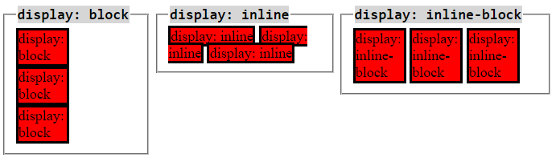

# What HTML tags have property display: inline, block, inline-block?

In HTML and CSS, different tags have different default display properties:

1. **Block-Level Elements**:
   - Block-level elements always start on a new line and take up the full width available.
   - Examples of block-level elements include `
`, `
`, `<h1>` to `<h6>`, `<ul>`, `<ol>`, `<li>`, `<table>`, and more.
   - They can set width, height, margins, and paddings in all directions.

2. **Inline Elements**:
   - Inline elements do not start on a new line and only take up as much width as necessary.
   - Examples of inline elements include ``, `<a>`, `<strong>`, `<em>`, ``, `<input>`, and more.
   - They cannot set explicit width or height.

3. **Inline-Block Elements**:
   - Inline-block elements behave like inline elements but allow you to set a width and height.
   - They also respect top and bottom margins/paddings.
   - Examples include `<button>`, `<label>`, and sometimes ``.
   - Allows setting width, height, margins, and paddings.
   